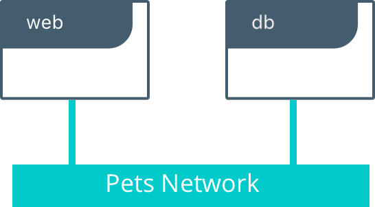
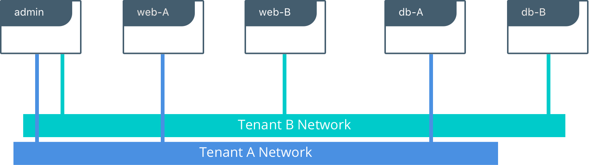

#Pets
Pets is a simple application that's useful for testing out features of Docker.

Pets is comprised of three container types:

- `web` is a front-end Python Flask container that serves up random images of housepets depending on what mode it is in
- `db` is a back-end redis database that stores the number of visits that each `web` service recieves
- `admin` is an administrative container that shows all the visits that each service has gotten

Pets can be deployed as a single-tenant app or multi-tenant app. In the multi-tenant version Pets creates multiple networks that isolate the different tenants from each other.

###Running Pets
####web
The `web` container has several required inputs.

- `-e ROLE` - this environment variable must be the value `cat` or `dog`. This will determine what type of animations are served.
- `-e DB` - this environment variable is the service name or `IP:port` location of the backend `db` container
- `-p <external port>:5000` determines the external port that content is served on. `web` runs internally on port `5000`

####db
The `db` container has no required inputs. It may require a service name if a service name is provided to `web` instead of an IP address.


####admin


###Single Tenant Deployment
In a single tenant deployment Pets deploys as a single `web` and a single `db` container. The `ROLE` can be either `cat` or `dog` depending on your preference and what kind of person you are. The Pets app will be externally reachable on port `8000`.

####Local Deployment

```
$ docker network create -d bridge petnet
$ docker run -d --net petnet --name cat-db redis
$ docker run -d --net petnet -p 8000:5000 -e 'DB=cat-db' -e 'ROLE=cat' markchurch/web 
```
####Swarm Deployment
```
$ docker network create -d overlay dognet
$ docker service create --network dognet --name dog-db redis
$ docker service create --network dognet -p 8000:5000 -e 'DB=dog-db' -e 'ROLE=dog' --name dog-web chrch/web
```

<br>
<p align="center">

</p>
<br>

Additional `web` containers can be added to achieve more front-end scale. 


###Multi Tenant Deployment
In a multi-tenant deployment Pets deploys as multiple independent services. You can instantiate a multi-tenant deployment by running `docker-compose up -f multi-tenant-compose.yml`. The service will be externally reachable on the following ports:

- Dogs on port `8000`
- Cats on port `8001`
- Admin on port `8002`

<br>
<p align="center">

</p>
<br>