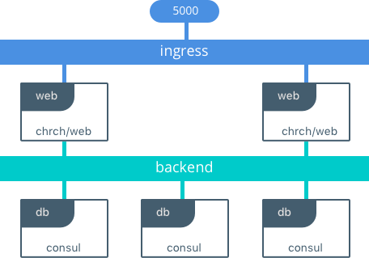
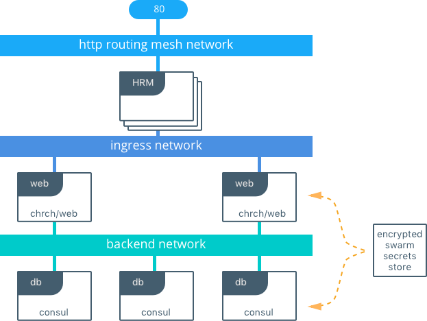

#The Pets Application
Pets is a simple application that's useful for testing out features of Docker.

Pets is comprised of two images:

- `chrch/web` is a front-end Python Flask container that serves up random images of housepets, depending on the given configuration
- `consul` is a back-end KV store that stores the number of visits that the `web` services recieve. It's configured to bootstrap itself with 3 replicas so that we have fault tolerant persistence.


###Running Pets on Swarm & UCP in Development
Docker Swarm can easily be set up to run applications on a single developer laptop. The full app can be brought up to run in the same way it would run in production. We use a compose v3 file to deploy a fully fault tolerant frontend and backend, along with the configurations, secrets, and networks required for the application to run.

This is the full architecture that is deployed when using [pets-dev-compose.yml](https://github.com/mark-church/pets/blob/master/pets-dev-compose.yml).

```
$ docker stack deploy -c pets-dev-compose.yml pets
Creating network pets_backend
Creating service pets_db
Creating service pets_web
```

 


####web
The `web` container has several configuration parameters as environment variables:

| Bridge | Options  | Purpose|
|:------:|------|----|
| **`ROLE`** | `dog | cat` | Toggles the animal deliverd by the app. Defaults to `dog`|
| **`DB`** |   `conatiner | service name` or  `<ip>:<port>`    | Tells `web` where to find `db`|


###Running Pets on Swarm & UCP in Production
Production apps have entirely different requirements when it comes to security, deployment, and also security. Fortunately, deployment on Swarm & UCP is very much the same from development to production. Some minor additions to our compose file add in capabilities for secrets and also for L7 load balancing.

This is the full architecture that is deployed when using [pets-dev-compose.yml](https://github.com/mark-church/pets/blob/master/pets-prod-compose.yml).

```
$ docker stack deploy -c pets-prod-compose.yml pets
Creating network pets_backend
Creating service pets_db
Creating service pets_web
```

 

